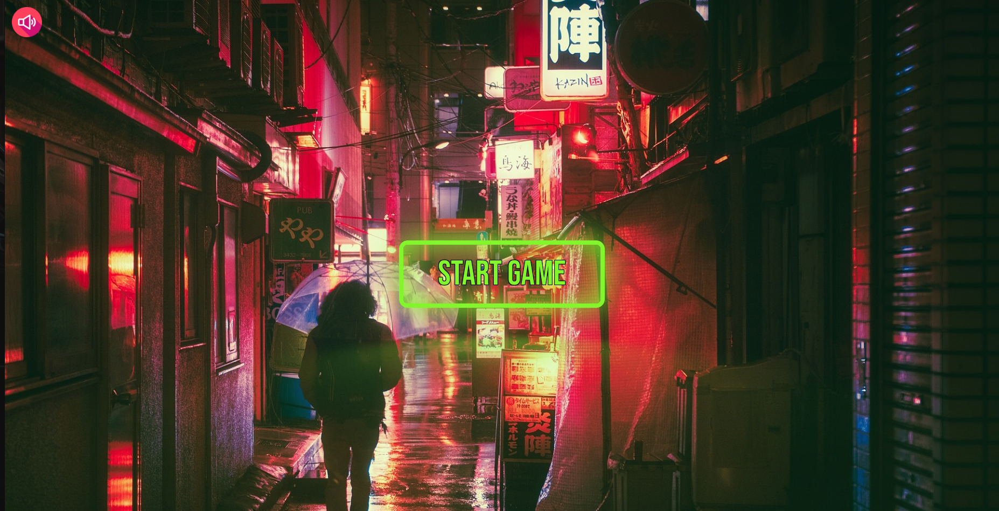
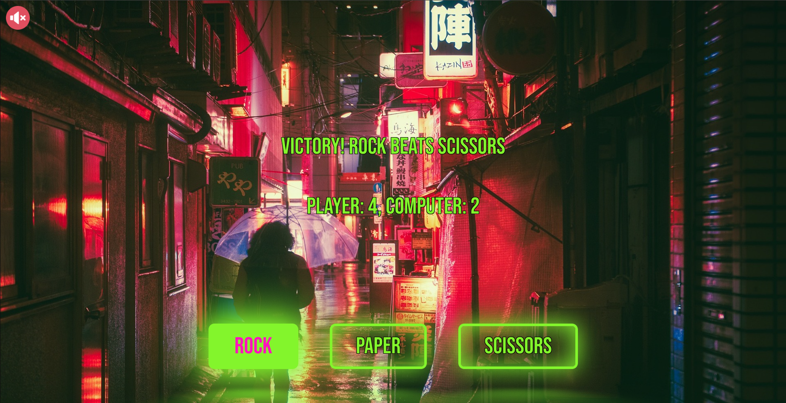
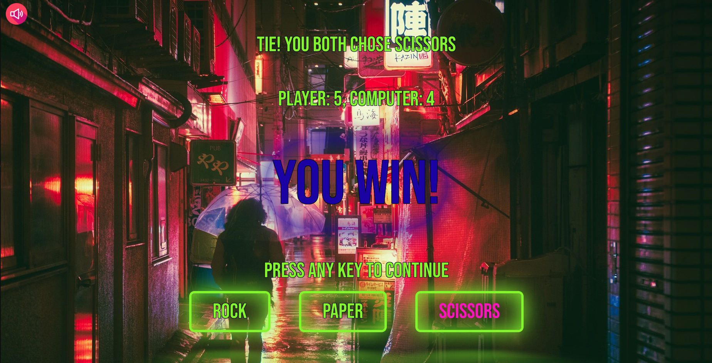
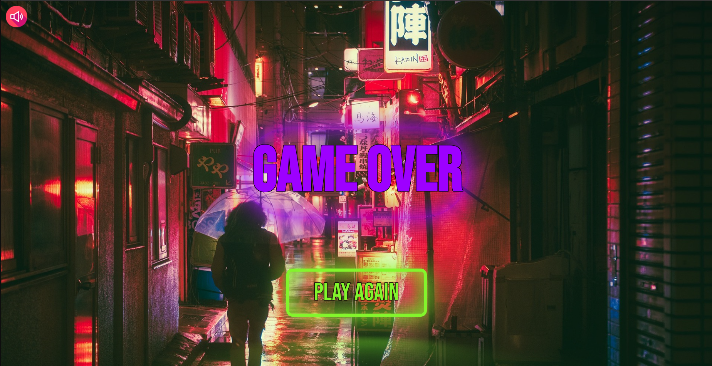

## Neon - Rock Paper Scissors

Neon Themed Rock Paper Scissors is a web game made by me using Javascript, CSS and HTML.

## Features

[x] Start and Game-Over screens.
[x] Neon themed buttons and text with animations.
[x] Background music and sound effects (Mute button found on top left).
[x] Compatible with various screen sizes (Including mobile).

## Deployment

Available live at: https://charbytesdev.github.io/neon-rps

A web game created with vanilla Javascript and styled usign CSS.

 

 
 

## Built With

- [HTML](https://developer.mozilla.org/en-US/docs/Web/HTML) - Hyper Text Markup Language
- [CSS](https://developer.mozilla.org/en-US/docs/Web/CSS) - Cascading Style Sheets
- [JS](https://developer.mozilla.org/en-US/docs/Web/JavaScript) - Programming Language
